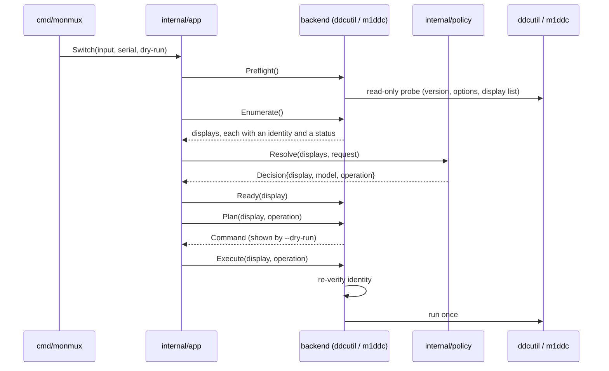

# Architecture

monmux switches a monitor between video inputs by running an external tool — `ddcutil` on Linux, `m1ddc` on macOS. It speaks no
I²C and no IOKit itself. Almost everything in this document is about the one question that matters: what stops the wrong bytes
reaching a monitor.

## Packages

| Package                    | What it is                                                                                                                |
| -------------------------- | ------------------------------------------------------------------------------------------------------------------------- |
| `internal/edid`            | Parses EDID block 0 into an identity: manufacturer, product code, serials, model name. No raw bytes leave it.             |
| `internal/refusal`         | The one refusal error, its closed set of reasons, and the message template every refusal renders through.                 |
| `internal/catalog`         | The supported-monitor catalog, written in YAML and rendered to Go. Which models, which inputs, which value, why.          |
| `internal/policy`          | Pure decision: given the attached displays and a request, which display and which operation — or which refusal.           |
| `internal/backend`         | What a backend *is*: `Display`, `Command`, `Check`, the `Backend` interface, and the shared tool-path trust check.        |
| `internal/backend/exec`    | The only place monmux runs an external program, and the fake that lets tests observe invocations without performing them. |
| `internal/backend/ddcutil` | The Linux backend (`//go:build linux`).                                                                                   |
| `internal/backend/m1ddc`   | The macOS backend (`//go:build darwin`); its parser and decisions carry no build tag and are tested everywhere.           |
| `internal/backend/select`  | Chooses the backend from the operating system. There is no override.                                                      |
| `internal/app`             | Orchestration: the steps of a switch, in the one order they may happen in.                                                |
| `internal/config`          | The three-key configuration file.                                                                                         |
| `cmd/monmux`               | The CLI: `info`, `switch`, `doctor`, `version`, `completion`.                                                             |

The dependency direction is one-way. `internal/backend` imports no backend implementation, which is what lets the decision
layers depend on the vocabulary without depending on `ddcutil` or `m1ddc`.

## A switch, end to end



Every step before `Execute` that fails produces a refusal, and a refusal means nothing was written. Once the tool has been
started that is no longer true, and monmux says so instead: an error from a tool that ran ends with "Whether the input-switch
command reached the monitor is unknown."

## The five things that make this safe

### 1. An operation can only come from the catalog

`catalog.Operation` carries the mechanism and the 16-bit value to write — a SetVCP sends an SH/SL pair — and its fields are
unexported. Its constructor is package-private, so the only operations that exist are the ones compiled in from the catalog.
The catalog is written in `internal/catalog/models.yaml` and rendered into the committed `models_gen.go` by `make go-generate`;
the rendering happens at development time, so the binary contains no catalog parser and reads no catalog file at run time, and a
test fails the build if the two files disagree. The zero value is invalid, and every backend rejects it with
`invalid-operation`. There is no code path that turns a number a user typed into an
operation — the CLI takes symbolic inputs, a connector kind such as `dp` or `hdmi` optionally numbered such as `hdmi2`, and
nothing else.

### 2. A command cannot be forged

`Backend.Plan` returns a `Command` for display; no method on the interface accepts one. `Execute` is given the
`catalog.Operation` and rebuilds the invocation through the same private planner `Plan` used. So no caller can hand a backend an
executable or an argument list of its choosing, and what `--dry-run` prints is produced by the same function that performs the
real run. A test walks the interface by reflection to keep it that way.

### 3. The identity is re-verified immediately before the write

Enumeration and the write are two moments in time, and a monitor can be unplugged between them. Before writing, the Linux
backend re-reads the connector's EDID byte for byte and re-resolves its `ddc` link to the same I²C bus; the macOS backend
re-lists the displays and confirms the UUID still carries the same identity. Any difference is `identity-changed`, and nothing
is sent. On Linux the write itself then selects the display by its full 256-character EDID rather than by a bus number, so
`ddcutil` refuses on its own if the monitor on that bus is no longer the one monmux identified.

### 4. A mechanism is a per-model property, never a fallback

`catalog.Mechanism` is a closed enum with two values: `lg-alt-input`, the LG side channel — source address `0x50`, VCP `0xF4`,
no verification — and `vcp-input-source`, the standard Input Source feature — the ordinary source address, VCP `0x60`, no
verification. It is the extension point for other vendors, and a mechanism is added only together with the first evidenced model
that needs it, never speculatively; a model that merely records it, disabled, counts as that model, and the backend path stays
untested on hardware until the first model using it is enabled.

A backend that does not implement a model's mechanism refuses with `invalid-operation` rather than trying another one. Adding
`vcp-input-source` did not make `0x60` a fallback for anything: monmux writes it only for a model whose catalog entry names it,
never because a monitor happens to read it (requirement 9.7).

### 5. Sent is not confirmed

The LG side channel has no reliable read-back, and current-input reads on the tested hardware were stale while switching still
worked. monmux therefore never runs `get input` or `get input-alt`, never decides anything from what a monitor says it is doing,
and never retries a write. Success is reported as "command sent … not independently confirmed", which is the strongest true
statement available (requirements 9.8, 9.11, 9.12).

## Where a display's identity comes from

Both backends produce the same `edid.Identity`, which is what lets one catalog serve both.

| Field         | Linux                                     | macOS                                                           |
| ------------- | ----------------------------------------- | --------------------------------------------------------------- |
| Manufacturer  | EDID bytes 8–9, decoded to a PNP ID       | IORegistry `ManufacturerID`, or `CGDisplayVendorNumber` decoded |
| Product code  | EDID bytes 10–11                          | `CGDisplayModelNumber`                                          |
| Serial number | EDID bytes 12–15                          | `CGDisplaySerialNumber`                                         |
| Serial string | EDID descriptor `0xFF`                    | IORegistry `AlphanumericSerialNumber`                           |
| Model name    | EDID descriptor `0xFC`                    | IORegistry `Product name`, or the display list's header name    |
| Handle        | the DRM connector name, e.g. `card1-DP-1` | the display's system UUID — private data, masked in output      |

A display monmux cannot address is still reported, with a status saying why: `no-ddc-channel`, `edid-unreadable`, `no-uuid`.
`info` lists it; policy can never select it.

A catalog entry matches on the manufacturer and the product code. The serials never take part: they identify a unit, not a
model. The model name normally does not either — it is context in `info` and nothing more — but an identity **may** pin it,
because a vendor reuses one product code across products. LG does: `GSM/0x7707` is claimed by the 32UD99, the 27UN880-B and the
32BL95U service manual. Pinning is what lets two such models live in one catalog without every match becoming ambiguous, so it
is used only there, and the generator refuses a bare identity beside a pinned one with the same code — otherwise the bare entry
would shadow the pinned one. A display whose model name is empty matches no pinned identity at all, which is the fail-closed
answer rather than a guess.

## What each backend actually runs

Linux, for the LG side channel:

```text
ddcutil --edid <256 hex characters> setvcp 0xF4 0xD1 --i2c-source-addr=0x50 --noverify
```

macOS, for the same operation:

```text
m1ddc display <system UUID> set input-alt 209
```

`0xD1` and `209` are the same value; `m1ddc` takes it in decimal. The EDID hex and the UUID identify a physical unit, so both are
masked in output unless `--show-serial` is given.
